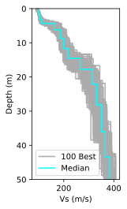

# SWprepost - A Python Package for Surface Wave Inversion Pre- and Post-Processing

> Joseph P. Vantassel, The University of Texas at Austin

[](https://zenodo.org/badge/latestdoi/222287042)
[](https://circleci.com/gh/jpvantassel/swprepost)
[](https://swprepost.readthedocs.io/en/latest/?badge=latest)
[](https://lgtm.com/projects/g/jpvantassel/swprepost/context:python)
[](https://www.codacy.com/manual/jpvantassel/swprepost?utm_source=github.com&amp;utm_medium=referral&amp;utm_content=jpvantassel/swprepost&amp;utm_campaign=Badge_Grade)
[](https://codecov.io/gh/jpvantassel/swprepost)

## Table of Contents

---

- [About _SWprepost_](#About-SWprepost)
- [A Few Examples](#A-Few-Examples)
- [Getting Started](#Getting-Started)

## About _SWprepost_

---

`SWprepost` is a Python package for performing surface wave inversion pre- and
post-processing. `SWprepost` was developed by Joseph P. Vantassel under the
supervision of Professor Brady R. Cox at The University of Texas at Austin. The
package includes 11 class definitions for interacting with the various
components required for surface wave inversion. It is designed to integrate
seamlessly with the Dinver module of the popular open-source software Geopsy,
however has been written in a general manner to ensure its usefulness with other
inversion programs. Furthermore, some of the class definitions provided such as
`GroundModel` may even be of use to those working in the Geotechnical or
Geophysical fields, but who do not perform surface wave inversions.

If you use `SWprepost` in your research or consulting we ask you please cite the
following:

> Joseph Vantassel. (2020). jpvantassel/swprepost: latest (Concept). Zenodo.
> http://doi.org/10.5281/zenodo.3839998

_Note: For software, version specific citations should be preferred to general_
_concept citations, such as that listed above. To generate a version specific_
_citation for `SWprepost`, please use the citation tool for that specific_
_version on the `SWprepost` [archive](https://doi.org/10.5281/zenodo.3839998)._

For the motivation behind the development of `SWprepost` and its role in a
larger project focused on developing a complete and rigorous workflow for
surface wave inversion please refer to and consider citing the following:

> Vantassel, J.P., Cox, B.R., (2020). SWinvert: A workflow for performing
> rigorous 1D surface wave inversions. Geophysical Journal International
> (Accepted) https://doi.org/10.1093/gji/ggaa426

## A Few Examples

All examples presented here can be replicated using the Jupyter notebook titled
`ReadmeExamples.ipynb` in the `examples` directory.

### Import 100 ground models in less than 0.5 seconds

```Python
time_start = time.perf_counter()
gm_suite = swprepost.GroundModelSuite.from_geopsy(fname="inputs/from_geopsy_100gm.txt")
time_stop = time.perf_counter()
print(f"Elapsed Time: {np.round(time_stop - time_start)} seconds.")
print(gm_suite)
```

```Bash
Elapsed Time: 0.0 seconds.
GroundModelSuite with 100 GroundModels.
```

### Plot the ground models

```Python
fig, ax = plt.subplots(figsize=(2,4), dpi=150)
# Plot 100 best
label = "100 Best"
for gm in gm_suite:
    ax.plot(gm.vs2, gm.depth, color="#ababab", label=label)
    label=None
# Plot the single best in different color
ax.plot(gm_suite[0].vs2, gm_suite[0].depth, color="#00ffff", label="1 Best")
ax.set_ylim(50,0)
ax.set_xlabel("Vs (m/s)")
ax.set_ylabel("Depth (m)")
ax.legend()
plt.show()
```



### Compute and plot their uncertainty

```Python
fig, ax = plt.subplots(figsize=(2,4), dpi=150)
disc_depth, siglnvs = gm_suite.sigma_ln()
ax.plot(siglnvs, disc_depth, color="#00ff00")
ax.set_xlim(0, 0.2)
ax.set_ylim(50,0)
ax.set_xlabel("$\sigma_{ln,Vs}$")
ax.set_ylabel("Depth (m)")
plt.show()
```


## Getting Started

---

### Installing or Upgrading _SWprepost_

1.  If you do not have Python 3.6 or later installed, you will need to do
so. A detailed set of instructions can be found
[here](https://jpvantassel.github.io/python3-course/#/intro/installing_python).

2.  If you have not installed `swprepost` previously use
`pip install swprepost`. If you are not familiar with `pip`, a useful tutorial
can be found [here](https://jpvantassel.github.io/python3-course/#/intro/pip).
If you have an earlier version and would like to upgrade to the latest version
of `swprepost` use `pip install swprepost --upgrade`.

3.  Confirm that `swprepost` has installed/updated successfully by examining the
last few lines of text displayed in the console.

### Using _SWprepost_

1.  Download the contents of the
  [examples](https://github.com/jpvantassel/swprepost/tree/master/examples)
  directory to any location of your choice.

2.  Explore the Jupyter notebooks in the
  [basic](https://github.com/jpvantassel/swprepost/tree/master/examples/basic)
  directory for a no-coding-required introduction to the `swprepost` package.
  If you have not installed `Jupyter`, detailed instructions can be found
  [here](https://jpvantassel.github.io/python3-course/#/intro/installing_jupyter).

3.  Move to the [adv](https://github.com/jpvantassel/swprepost/tree/master/examples/adv)
  directory and follow the Jupyter notebook title `SWinvertWorkflow.ipynb` for
  an example application of `swprepost` to the SWinvert workflow
  (Vantassel and Cox, 2020).

4.  Enjoy!
